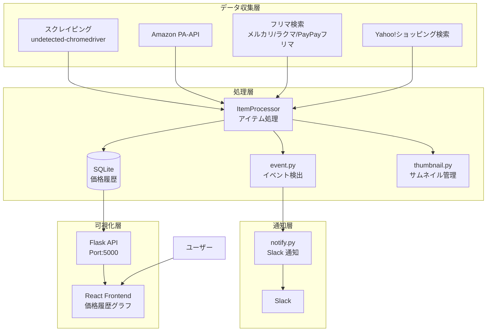
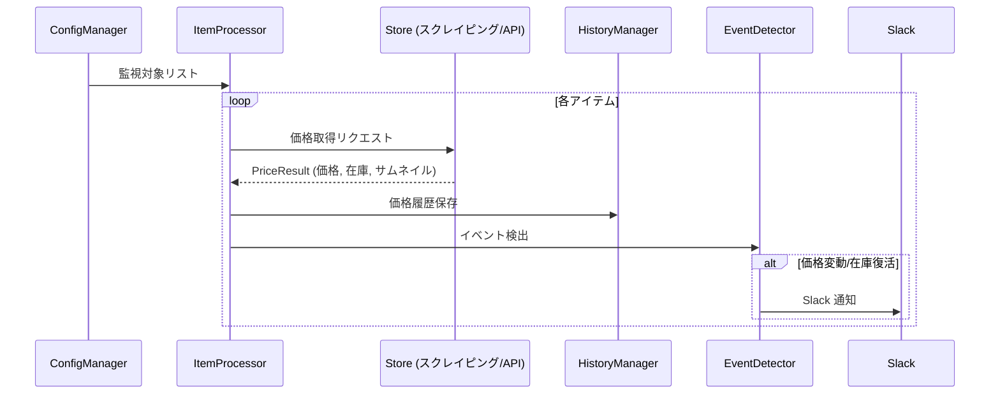

# price-watch

オンラインショップの価格を監視し、価格変動や在庫復活を Slack に通知するシステム 🛒💰

[](https://github.com/kimata/price-watch/actions/workflows/test.yaml)
[](https://kimata.github.io/price-watch/pytest.html)
[](https://coveralls.io/github/kimata/price-watch?branch=main)

## 📋 目次

- [概要](#概要)
- [システムアーキテクチャ](#システムアーキテクチャ)
    - [全体構成](#全体構成)
    - [データフロー](#データフロー)
    - [モジュール構成](#モジュール構成)
- [セットアップ](#セットアップ)
- [実行方法](#実行方法)
- [設定ファイル](#設定ファイル)
- [Web UI](#web-ui)
- [テスト](#テスト)
- [ライセンス](#ライセンス)

## 📖 概要


Selenium と undetected-chromedriver を使用してオンラインショップをスクレイピングし、価格変動を検出して Slack に通知します。Amazon PA-API やメルカリ/ラクマ/PayPayフリマ/Yahoo!ショッピングのキーワード検索にも対応しています。

### ✨ 主な特徴

| 機能                      | 説明                                                                                         |
| ------------------------- | -------------------------------------------------------------------------------------------- |
| 🛍️ **マルチストア対応**   | Amazon、ヨドバシ、Yahoo!ショッピング、メルカリ、ラクマ、PayPayフリマなど多数のショップに対応 |
| 🤖 **Bot 検出回避**       | undetected-chromedriver による高度な Bot 検出回避                                            |
| 🔊 **reCAPTCHA 自動突破** | 音声認識による reCAPTCHA の自動処理                                                          |
| 📊 **価格履歴グラフ**     | React フロントエンドによる価格推移の可視化                                                   |
| 🔔 **Slack 通知**         | 価格下落・在庫復活をリアルタイム通知                                                         |
| ⚡ **ホットリロード**     | 監視対象設定の動的再読み込み                                                                 |
| 📈 **メトリクス表示**     | 巡回状況のリアルタイムモニタリング                                                           |

### 🏪 対応ショップ

| ショップ           | 取得方法                | 備考                      |
| ------------------ | ----------------------- | ------------------------- |
| Amazon.co.jp       | PA-API / スクレイピング | ASIN 指定                 |
| メルカリ           | キーワード検索          | 新着商品検出              |
| ラクマ             | キーワード検索          | 新着商品検出              |
| PayPayフリマ       | キーワード検索          | 新着商品検出              |
| Yahoo!ショッピング | API / スクレイピング    | キーワード/JAN コード検索 |
| ヨドバシ.com       | スクレイピング          |                           |
| Switch Science     | スクレイピング          |                           |
| Ubiquiti Store USA | スクレイピング          |                           |
| Lenovo             | スクレイピング          |                           |

## 🏗️ システムアーキテクチャ

### 全体構成



### データフロー



### モジュール構成

```
src/
└── price_watch/
    ├── __main__.py             # メインエントリーポイント
    ├── cli/                    # CLI エントリーポイント群
    │   ├── app.py              # price-watch コマンド
    │   ├── webui.py            # price-watch-webui
    │   └── healthz.py          # price-watch-healthz
    │
    ├── app_context.py          # アプリケーションコンテキスト（ファサード）
    ├── processor.py            # アイテム処理（共通処理抽出）
    ├── exceptions.py           # 例外階層
    ├── models.py               # 型安全なデータモデル（dataclass）
    │
    ├── managers/               # Manager パターンによる責務分離
    │   ├── config_manager.py   # 設定管理（ホットリロード対応）
    │   ├── browser_manager.py  # WebDriver ライフサイクル
    │   ├── history_manager.py  # 履歴 DB 管理
    │   └── metrics_manager.py  # メトリクス統計
    │
    ├── store/                  # ストア別価格取得
    │   ├── scrape.py           # スクレイピング
    │   ├── flea_market.py      # フリマ検索（メルカリ/ラクマ/PayPayフリマ）
    │   ├── yahoo.py            # Yahoo!ショッピング検索
    │   └── amazon/             # Amazon 関連
    │       ├── paapi.py        # PA-API
    │       └── paapi_rate_limiter.py
    │
    ├── captcha.py              # CAPTCHA 処理
    ├── event.py                # イベント検出・記録
    ├── notify.py               # Slack 通知
    ├── history.py              # 価格履歴管理（SQLite）
    └── thumbnail.py            # サムネイル画像管理

frontend/                       # React フロントエンド
└── src/
    ├── App.tsx                 # メインアプリ
    ├── components/
    │   ├── ItemCard.tsx        # 商品カード
    │   ├── ItemDetailPage.tsx  # 商品詳細ページ
    │   ├── PriceChart.tsx      # 価格履歴グラフ
    │   ├── MetricsPage.tsx     # メトリクスページ
    │   └── ...
    └── services/
        └── apiService.ts       # API 通信
```

## 🚀 セットアップ

### 必要な環境

- Python 3.11+（推奨: 3.13）
- Node.js 18.x+
- Chrome / Chromium
- Docker（オプション）

### 1. 依存パッケージのインストール

```bash
# uv のインストール（未インストールの場合）
curl -LsSf https://astral.sh/uv/install.sh | sh

# Python 環境
uv sync

# React フロントエンド
cd frontend && npm ci && npm run build && cd ..
```

### 2. 設定ファイルの準備

```bash
cp config.example.yaml config.yaml
cp target.example.yaml target.yaml
# 各ファイルを環境に合わせて編集
```

## ▶️ 実行方法

### 通常実行

```bash
# 価格監視を開始
uv run price-watch

# デバッグモード（各ストア1アイテムのみチェックして終了）
uv run price-watch -D

# 設定ファイル指定
uv run price-watch -c config.yaml -t target.yaml

# Web UI ポート指定
uv run price-watch -p 5000
```

### 特定アイテムのデバッグ

```bash
# 特定のストアのみチェック（部分一致）
uv run price-watch --store ヨドバシ

# 特定の商品名のみチェック（部分一致）
uv run price-watch --item "キレイキレイ"

# ストアと商品名の両方で絞り込み
uv run price-watch --item "キレイキレイ" --store "アマゾン"
```

`--item` や `--store` を指定すると自動的にデバッグモードになり、マッチしたアイテムのみをチェックして終了します。

### Web UI のみ起動

```bash
uv run price-watch-webui
```

### ヘルスチェック

```bash
uv run price-watch-healthz
```

### Docker Compose で実行

Docker イメージは GitHub Container Registry で公開されています。
`compose.yaml` を使って手軽に起動できます。

#### 1. 設定ファイルの準備

```bash
cp config.example.yaml config.yaml
cp target.example.yaml target.yaml
```

`config.yaml` に Slack Bot トークンや API キーを、`target.yaml` に監視対象の商品を設定します。
詳細は[設定ファイル](#設定ファイル)を参照してください。

#### 2. データディレクトリの作成

```bash
mkdir -p data
```

価格履歴 DB・サムネイル画像・メトリクス等の永続データが保存されます。

#### 3. コンテナの起動

```bash
docker compose up -d
```

#### 4. 動作確認

Web UI に `http://localhost:5000` でアクセスできます。

ログを確認するには:

```bash
docker compose logs -f
```

#### 5. 停止・再起動

```bash
# 停止
docker compose down

# 設定変更後の再起動
docker compose up -d
```

#### compose.yaml の構成

```yaml
services:
    price-watch:
        image: ghcr.io/kimata/price-watch:latest
        volumes:
            - ./config.yaml:/opt/price-watch/config.yaml:ro
            - ./target.yaml:/opt/price-watch/target.yaml:ro
            - ./data:/opt/price-watch/data
        ports:
            - "5000:5000"
```

| マウント      | 説明                                              |
| ------------- | ------------------------------------------------- |
| `config.yaml` | アプリケーション設定（読み取り専用）              |
| `target.yaml` | 監視対象設定（読み取り専用）                      |
| `data/`       | 価格履歴 DB・サムネイル・メトリクス等の永続データ |

| ポート | 説明              |
| ------ | ----------------- |
| 5000   | Web UI / REST API |

## ⚙️ 設定ファイル

### config.yaml

```yaml
check:
    interval_sec: 1800 # 監視周期（秒）

slack:
    bot_token: "xoxb-..." # Slack Bot トークン
    from: "price-watch"
    info:
        channel:
            name: "#price" # 通知チャンネル
    error:
        channel:
            name: "#error"
        interval_min: 60 # エラー通知の最小間隔

store:
    amazon:
        associate: "XXXXXX-22" # アソシエイト ID
        access_key: "..." # PA-API アクセスキー
        secret_key: "..." # PA-API シークレットキー

    yahoo:
        client_id: "..." # Yahoo! Client ID
        secret: "..." # Yahoo! Client Secret

data:
    selenium: ./data # Selenium プロファイル
    dump: ./data/debug # デバッグダンプ
    price: ./data/price # 価格履歴 DB
    thumb: ./data/thumb # サムネイル画像

liveness:
    file:
        crawler: /dev/shm/healthz
    interval_sec: 300
```

### target.yaml

```yaml
store_list:
    # スクレイピング対象ストアの定義
    - name: ヨドバシ
      price_xpath: '//span[@id="js_scl_salesPrice"]/span[1]'
      thumb_img_xpath: '//img[@id="mainImg"]/@src'
      unavailable_xpath: '//p[contains(@class, "orderInfo")]/span[text()="販売休止中"]'

    # Amazon PA-API
    - name: Amazon
      check_method: my_lib.store.amazon.api

    # Yahoo!ショッピング API
    - name: Yahoo
      check_method: my_lib.store.yahoo.api

    # フリマ検索
    - name: メルカリ
      check_method: my_lib.store.mercari.search

    - name: ラクマ
      check_method: my_lib.store.rakuma.search

    - name: PayPayフリマ
      check_method: my_lib.store.paypay.search

item_list:
    # 1アイテムに複数ストアを紐付け可能
    - name: 商品名
      store:
          # スクレイピング対象商品
          - name: ヨドバシ
            url: https://www.yodobashi.com/product/...
          # Amazon PA-API
          - name: Amazon
            asin: B0XXXXXXXX

    # Yahoo!ショッピング検索（キーワード）
    - name: Yahoo商品
      store:
          - name: Yahoo
            search_keyword: 検索キーワード # 省略時は name で検索
            price:
                - 10000 # price_min
                - 50000 # price_max
            cond: new # new（デフォルト）or used

    # Yahoo!ショッピング検索（JANコード）
    - name: Yahoo商品（JAN）
      store:
          - name: Yahoo
            jan_code: "4901234567890"

    # フリマ検索（メルカリ・ラクマ・PayPayフリマ）
    - name: フリマ商品
      store:
          - name: メルカリ
            search_keyword: 検索キーワード
            price:
                - 5000 # price_min
                - 20000 # price_max
          - name: ラクマ
            search_keyword: 検索キーワード
          - name: PayPayフリマ
            search_keyword: 検索キーワード
```

## 🖥️ Web UI

### 価格履歴ダッシュボード

`http://localhost:5000` でアクセス可能な React ベースの Web UI を提供しています。

**機能:**

- 📊 商品別の価格推移グラフ
- 📈 価格変動イベント履歴
- 🔍 商品詳細ページ
- 📉 メトリクス（巡回状況モニタリング）

### API エンドポイント

| エンドポイント                           | 説明           |
| ---------------------------------------- | -------------- |
| `GET /price-watch/api/item`              | アイテム一覧   |
| `GET /price-watch/api/item/<id>`         | アイテム詳細   |
| `GET /price-watch/api/item/<id>/history` | 価格履歴       |
| `GET /price-watch/api/event`             | イベント一覧   |
| `GET /price-watch/api/metrics`           | メトリクス     |
| `GET /price-watch/api/thumb/<id>`        | サムネイル画像 |

## 🧪 テスト

```bash
# ユニットテスト（高速、外部アクセスなし）
uv run pytest tests/unit/

# 全テスト（E2E を除く）
uv run pytest

# E2E テスト（外部サーバー必要）
uv run pytest tests/e2e/ --host <host> --port <port>

# 型チェック
uv run pyright

# カバレッジレポート
uv run pytest --cov=src --cov-report=html
```

## 🔧 トラブルシューティング

### Chrome が起動しない

```bash
# Chrome/Chromium がインストールされているか確認
which chromium-browser || which google-chrome

# 必要なライブラリのインストール（Ubuntu）
sudo apt install -y chromium-browser
```

### reCAPTCHA が解決できない

- reCAPTCHA 以外の画像認証の場合、`data/debug` フォルダのスクリーンショットを確認
- ターミナルに表示される入力プロンプトに回答を入力

### Slack 通知が届かない

1. Bot トークンの権限を確認（`chat:write`, `files:write`）
2. Bot がチャンネルに招待されているか確認
3. チャンネル ID が正しいか確認

## 📝 ライセンス

Apache License Version 2.0

---

[Issue 報告](https://github.com/kimata/price-watch/issues) | [Wiki](https://github.com/kimata/price-watch/wiki)
